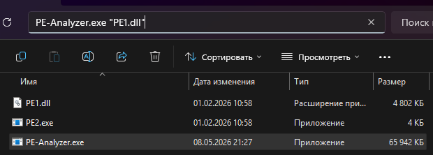
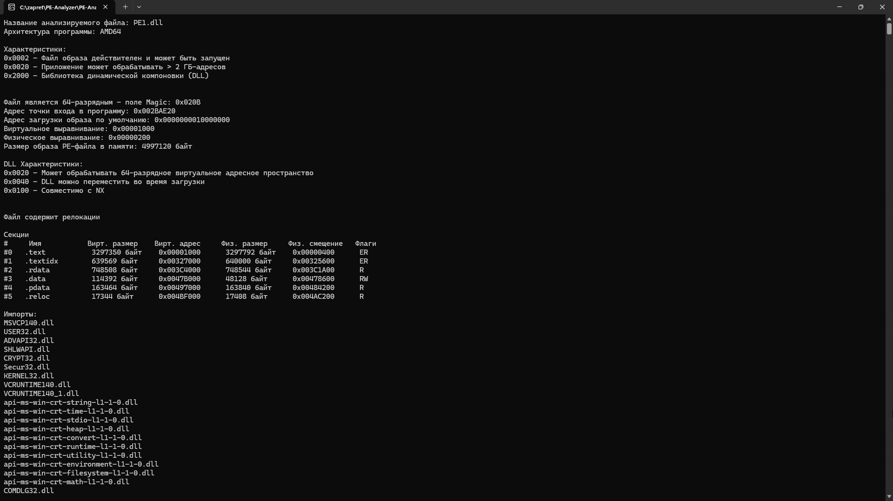
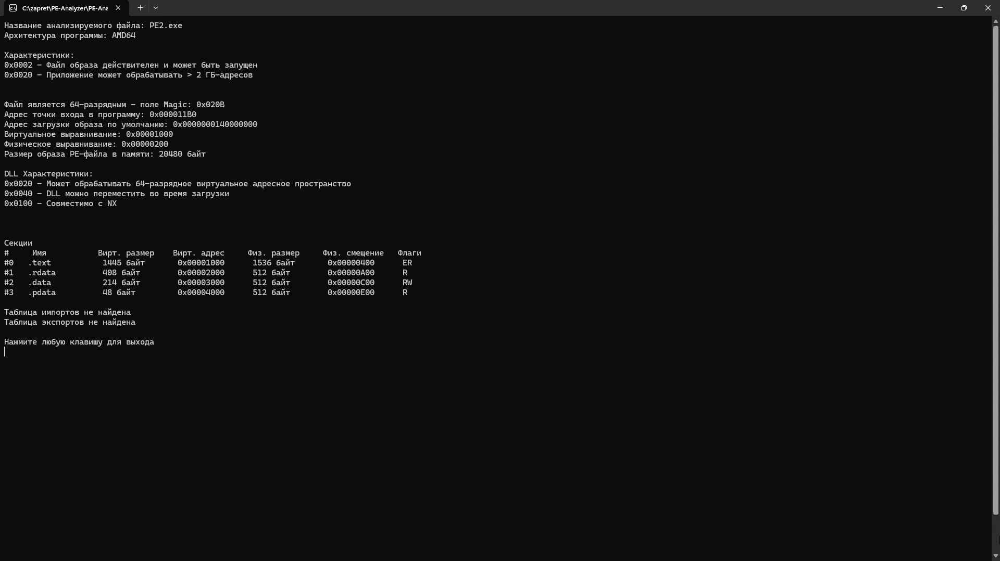

# PE-Analyzer

PE-анализатор для лабораторной работы №1.  
Выполнил Илья Попов.

---

## Использование

Программа принимает путь к анализируемому файлу в качестве аргумента командной строки.

---

## Результаты работы

### PE1.dll

### PE2.exe

